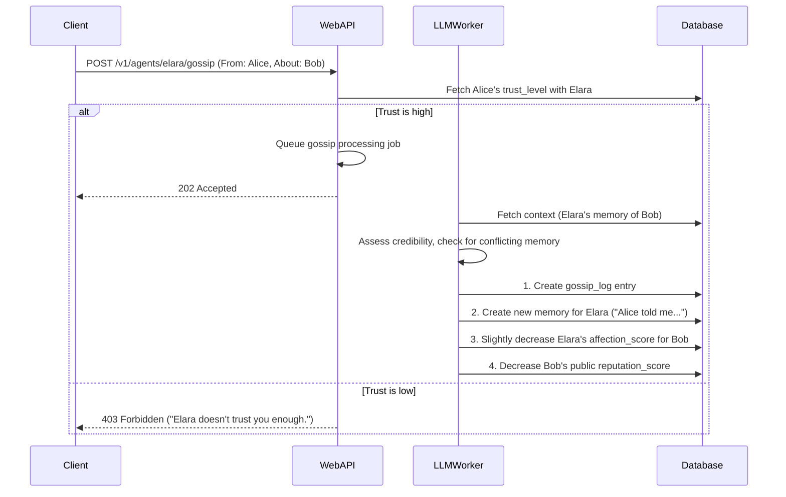
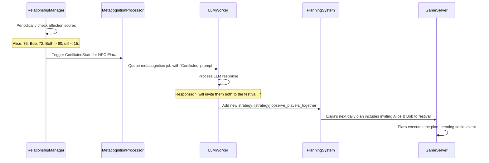

# Technical Design Document: Competitive Social & Relationship System

## 1. Introduction & Vision

This document outlines the technical design for the **Competitive Social & Relationship System** in Heartwood Valley. The system is designed to create a dynamic, AI-driven social environment where players compete for the affection and trust of NPCs. This is achieved through direct interaction, social influence, and strategic manipulation of information.

The vision is to move beyond simple, numerical relationship scores and create a system where NPCs are aware of their social landscape. They will use their existing cognitive faculties (Memory, Reflection, Metacognition) to interpret complex social situations, form strategies, and behave in an emergent, believable manner.

This system is comprised of two core models:
1.  **The Romantic Contention Model**: Governs how an NPC navigates romantic interest from multiple players, driven by an internal "Contention State."
2.  **The Social Influence & Sabotage Model**: Allows players to manipulate the social landscape through gossip, witnessed actions, and a public reputation system.

This document assumes the existing microservices architecture (`game-server`, `web-api`, `database`) and builds upon the operational AI systems (`AgentMemoryManager`, `ReflectionProcessor`, `MetacognitionProcessor`, `AgentObservationSystem`).

## 2. Core Mechanics & Data Models

To support this new system, we will introduce new data structures and modify existing ones.

### 2.1. Database Schema Modifications

#### 2.1.1. `agent_player_relationships` Table
This table will be updated to track the new contention state and relationship status.

```sql
-- existing columns: agent_id, character_id, affection_score, trust_level, etc.
ALTER TABLE agent_player_relationships
ADD COLUMN contention_state VARCHAR(20) DEFAULT 'open', -- ('open', 'conflicted', 'focused', 'exclusive')
ADD COLUMN relationship_status VARCHAR(50) DEFAULT 'acquaintance'; -- ('acquaintance', 'friend', 'close_friend', 'romantic_interest', 'dating', 'estranged')
```

#### 2.1.2. New Table: `player_reputations`
A new table to store the public reputation of each player.

```sql
CREATE TABLE player_reputations (
    character_id UUID PRIMARY KEY REFERENCES characters(id),
    reputation_score INT DEFAULT 50, -- Starts at a neutral 50 on a 0-100 scale
    last_updated TIMESTAMPTZ DEFAULT now()
);
```

#### 2.1.3. New Table: `gossip_logs`
A new table to log gossip events for AI processing and accountability.

```sql
CREATE TABLE gossip_logs (
    id BIGSERIAL PRIMARY KEY,
    source_character_id UUID REFERENCES characters(id) NOT NULL,
    target_character_id UUID REFERENCES characters(id) NOT NULL, -- The player being gossiped about
    npc_listener_id VARCHAR(50) REFERENCES agents(id) NOT NULL,
    content TEXT NOT NULL,
    is_positive BOOLEAN NOT NULL,
    credibility_score INT DEFAULT 50, -- How much the NPC believes it (0-100)
    timestamp TIMESTAMPTZ DEFAULT now()
);
```

### 2.2. The Romantic Contention Model

This model is managed by a new `RelationshipManager` service within the `web-api`. This service periodically evaluates the `agent_player_relationships` for each NPC to determine their `contention_state`.

#### **States & Triggers:**

*   **`Open`**: Default state. No player has reached the `Close Friend` tier or a high `affection_score` (e.g., > 60).
*   **`Conflicted`**:
    *   **Trigger**: Two or more players are in the `Close Friend` tier and their `affection_score`s are within a tight range (e.g., <= 15 points apart).
    *   **Effect**: Triggers a high-priority **Metacognitive Event**.
*   **`Focused`**:
    *   **Trigger**: One player (the "Top Suitor") has a significant `affection_score` lead (e.g., > 20 points) over all other rivals in the `Close Friend` tier.
    *   **Effect**: Triggers a **Reflection Event**.
*   **`Exclusive`**:
    *   **Trigger**: The Top Suitor successfully completes the NPC-initiated "defining moment."
    *   **Effect**: A permanent `relationship_status` of `dating` (or similar) is set. The `contention_state` becomes `exclusive`. This state heavily influences all future social AI processing, preventing romantic advancement with others.

### 2.3. The Social Influence & Sabotage Model

#### **Gossip System:**

*   **Initiation**: A player with high `trust_level` with an NPC gains a "Gossip" dialogue option.
*   **Mechanics**: The player can choose a target (another player) and deliver a positive or negative piece of gossip.
*   **Impact**:
    1.  A new entry is created in `gossip_logs`.
    2.  The `credibility_score` is determined by the gossiper's `trust_level` with the NPC.
    3.  The gossip affects the target player's `reputation_score` and their `affection_score` with the listening NPC, weighted by the credibility.
    4.  The system is designed to be subtle; a single piece of gossip won't ruin a relationship but creates memory patterns.

#### **Witness System:**

*   This is an enhancement to the existing `AgentObservationSystem`.
*   Key social actions (e.g., giving a gift, pushing another character, destroying crops) will be tagged as `witnessable_social_event`.
*   When an NPC is nearby and observes such an event, it creates a high-importance `Observation` memory. E.g., `Observation: I saw Player Alice give Player Bob a valuable gem. It seemed like a very kind gesture.`
*   These "witnessed" memories have high credibility and will be used by the Metacognition system to validate or contradict gossip.

#### **Reputation System:**

*   Managed by the `ReputationManager` in the `web-api`.
*   A player's `reputation_score` is a weighted average based on `gossip_logs` and witnessed positive/negative actions stored in NPC memories.
*   **Effect**:
    *   NPCs use a player's public `reputation_score` to inform their initial disposition and greetings.
    *   A very low reputation may cause NPCs to be unwilling to engage in conversation or trust gossip from that player.

## 3. AI System Integration

### 3.1. Metacognition Integration (`MetacognitionProcessor`)

The Metacognition system is the core of the NPC's strategic social reasoning.

*   **New Triggers**:
    1.  Entering the `Conflicted` state.
    2.  Receiving gossip that contradicts a strongly held memory (e.g., "Player Alice told me Bob is cruel, but I saw Bob help Sarah the farmer last week.").
*   **Process**:
    1.  A high-priority job is sent to the `LLMWorker`.
    2.  A specialized prompt is constructed.
        *   **Conflicted State Prompt**: `"You have strong positive feelings for both Player Alice (Affection: 75) and Player Bob (Affection: 72). This is a complex social situation. How do you feel about this? What is your strategy for navigating these relationships fairly and finding clarity?"`
        *   **Conflicting Info Prompt**: `"You heard from Alice that Bob is rude. However, you recently witnessed Bob being kind to Sarah. This information is contradictory. What is your assessment of this situation, and what is your strategy for determining Bob's true character?"`
    3.  **Output**: The LLM's response is parsed and stored as a `Metacognition` memory. Crucially, it generates short-term **strategic goals**, such as:
        *   `[strategy] observe_players_together`
        *   `[strategy] seek_counsel_from_friend Elara`
        *   `[strategy] form_own_opinion_of Bob`

### 3.2. Reflection Integration (`ReflectionProcessor`)

Reflections handle significant relationship milestones, shaping the NPC's long-term feelings.

*   **New Triggers**:
    1.  Entering the `Focused` state.
    2.  Successfully completing a "defining moment."
*   **Process**:
    1.  A job is sent to the `LLMWorker`.
    2.  **Focused State Prompt**: `"Your relationship with Player Alice (Affection: 90) feels much deeper and more significant than with anyone else. Reflect on your recent interactions with them. What does this relationship mean to you, and what are you hoping it might become?"`
    3.  **Output**: The reflection is stored. It also generates a new high-priority **long-term goal** for the `PlanningSystem`, such as `[goal] initiate_defining_moment_with Player_Alice`.

### 3.3. Planning & Activity Integration

The strategic goals generated by the AI must translate into observable in-game actions.

*   **New Goals**: The `PlanExecutor` needs to be taught how to handle the new goals (e.g., `initiate_defining_moment_with`, `observe_players_together`).
*   **New Activities**: The `ActivityManifest` will be expanded with new social activities:
    *   `planning_special_outing`: An NPC-driven quest/scene.
    *   `inviting_group_hangout`: For observation purposes.
    *   `seeking_advice`: The NPC will path to a friend and have a simulated conversation.

## 4. New Game Mechanics & API Endpoints

### 4.1. New API Endpoints

*   **`POST /v1/agents/:agentId/gossip`**
    *   **Body**: `{ "targetCharacterId": "...", "gossipContent": "...", "isPositive": true }`
    *   **Auth**: Requires JWT token for the source player.
    *   **Function**: Initiates the gossip flow. Requires high trust between the source player and the agent.

### 4.2. UI/UX Changes

*   **Dialogue System**: When trust is high enough, a "Spread Gossip" option appears in the dialogue tree.
*   **NPC Behavior**: The NPC's state will be communicated subtly through dialogue, not explicit UI.
    *   **Conflicted**: "It's lovely to see you. I was just thinking, it would be nice if you and Bob could join me at the festival later."
    *   **Focused**: "You're a wonderful friend to everyone in this town." (to a rival). "I was hoping I'd run into you. I have something special I'd like to talk to you about later." (to the Top Suitor).

## 5. Data Flow Diagrams

### 5.1. Flow: Spreading Negative Gossip



### 5.2. Flow: NPC Enters 'Conflicted' State



## 6. Security & Exploits

*   **Gossip Spamming**: A cooldown will be implemented on the gossip API endpoint per player. Trust is also a major gatekeeper.
*   **Reputation Bombing**: The Metacognition system's ability to check for conflicting information makes this difficult. An NPC won't blindly trust gossip that contradicts its own observations. This makes "witnessed" good deeds a powerful countermeasure.
*   **Collusion**: Players could collude to spread gossip. While possible, the system's reliance on individual NPC memories and trust levels mitigates this. A group of players Bob doesn't know will have little influence on his reputation with his close friends. 